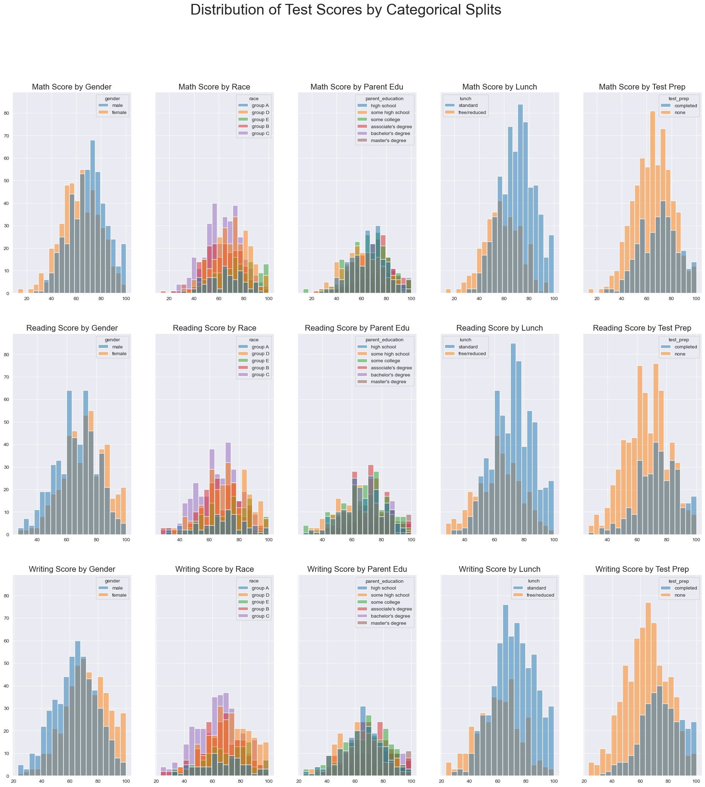
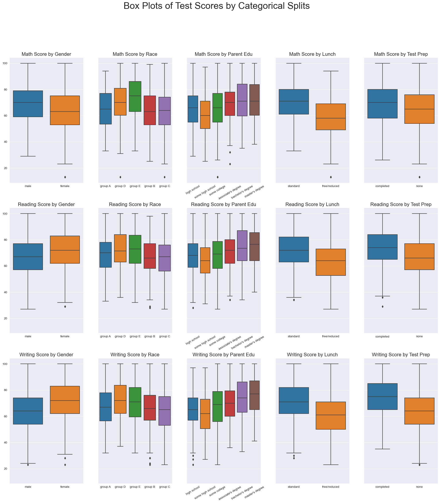
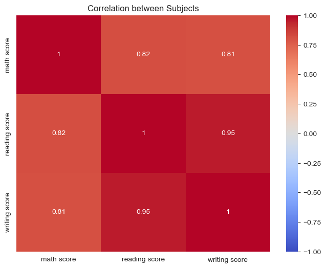
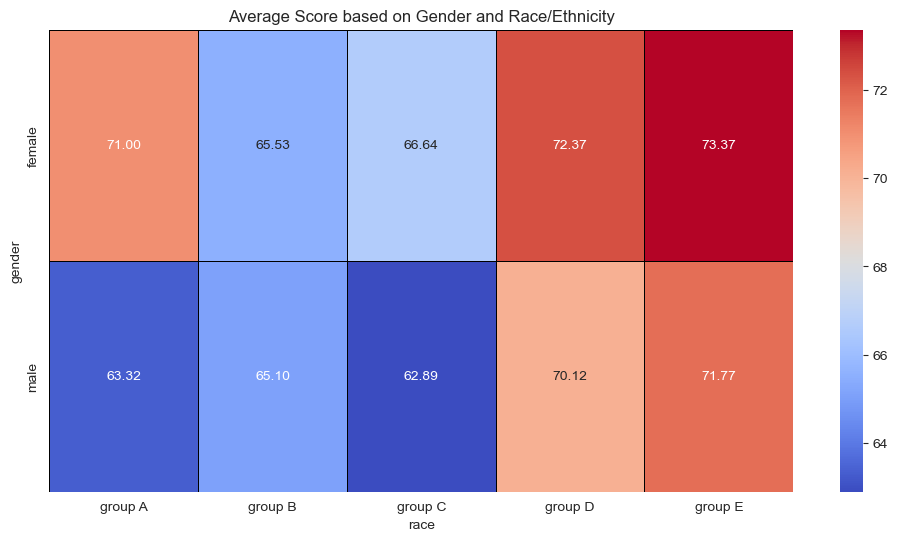
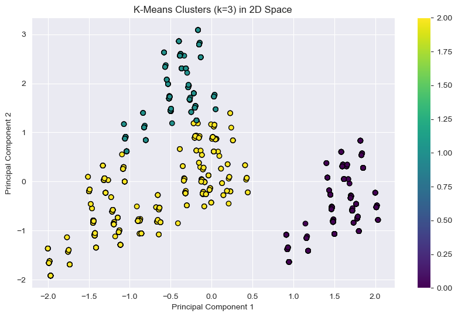
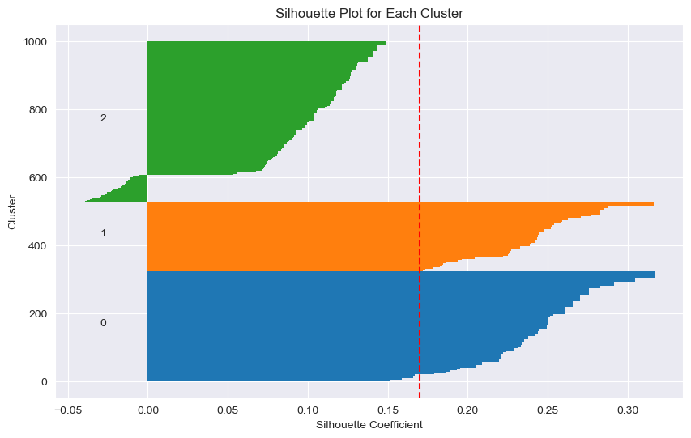

# Examination Analysis Repository

Welcome to the Examination Analysis Repository, where we study test scores.

## Overview

This repository houses the exploratory analysis of exam test score data. The primary dataset originates from [Kaggle](https://www.kaggle.com/datasets/whenamancodes/students-performance-in-exams) and offers a canvas for both foundational and intricate analytical techniques.

### exam_analysis.ipynb

This Jupyter notebook is central to our exploration. Here's a glimpse of what's inside:

- **Libraries Used**: The notebook utilises Python libraries such as `pandas`, `numpy`, `matplotlib`, and `seaborn` for data manipulation, analysis, and visualisation.
- **Data Inspection**: The dataset is systematically loaded, followed by visual and statistical examinations to understand its structure and metrics.
- **Visualisations**: The notebook delves into various visual techniques:
  - **Distribution Plots**: These plots offer insights into the spread of exam scores, revealing patterns like bell-shaped distributions in Math scores and left-skewed distributions in Reading and Writing scores.
  - **Box Plots**: By splitting data into categories, these plots provide a comprehensive view of the data's spread and outliers.
  
While this notebook offers a foundational exploration, a deeper future dive may provide better insights via clustering analysis.

### Visualisations

**dist_matrix.png**: 
A graphical representation of the distribution matrix, illustrating the distances between various data points.

**box_matrix.png**:  
A matrix of box plots, displaying the distribution, median, and outliers for different metrics.

**subject_correlation.png**:  
A visual representation of the correlation between subjects, unravelling interdisciplinary patterns.

   
**grouped_gender_race.png**:  
This plot showcases the distribution of exam scores across gender and race, offering demographic insights.

**clustering_plot.png**:  
A snapshot of how data points cluster together, revealing the inherent groupings in the exam dataset.

**silhouette_plot.png**:  
An essential tool for gauging the efficiency of clustering techniques, it depicts data cluster coherence and separation.

## Conclusion

There are significant statistical differences in test scores based on the features analysed shown in the [Notebook](exam_analysis.ipynb) itself. Predictive modelling proved somewhat weak with the methods used, however, upon exploring clustering we see at least one very distinct cluster of scores. As further work, investigating these clusters and prediction for them individually may prove fruitful.
